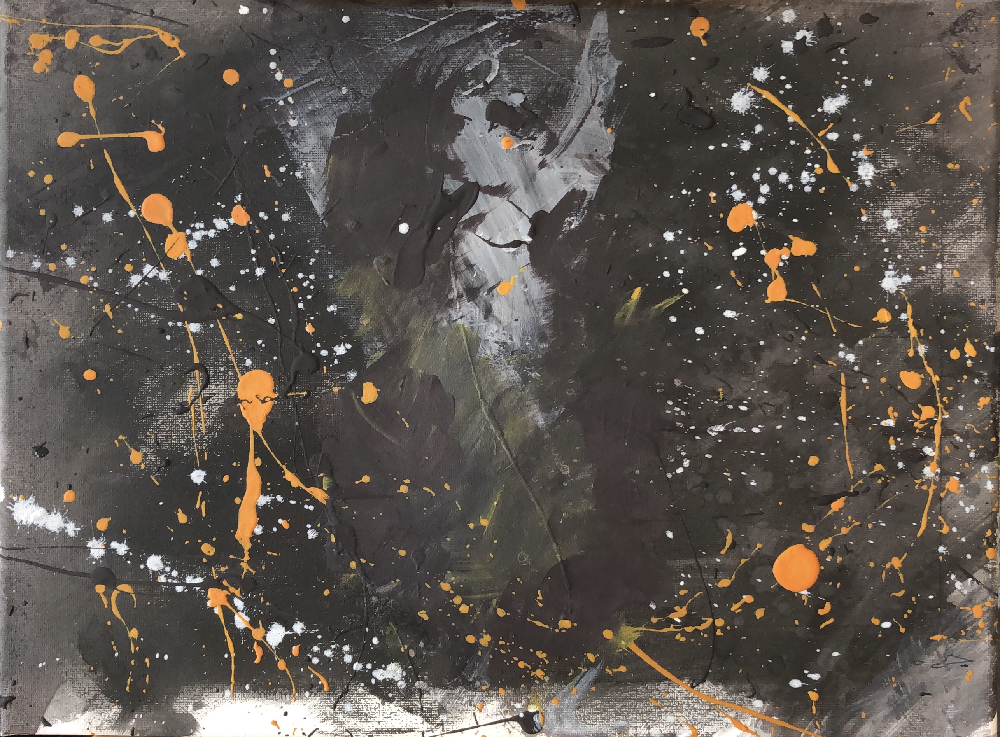

# La salida de la oscuridad

- Representa la depresión que vivió el autor en 2020.

- La línea blanca de abajo representa las cenizas, teniendo en cuenta la mitología griega del Ave Fénix (Bennu para la mitología egipcia).
- El Ave Fénix tiene sus representaciones en diferentes culturas, como la china (el Fêng-Huang), la japonesa (el Ho-oo), la rusa ( El Pájaro de Fuego , que inmortalizara musicalmente Stravinsky), la Egipcia (el Benu), la hindú (el Garuda), e incluso en los indios de norteamérica (el Yel), o los Aztecas, Mayas y Toltecas (el Quetzal). Fue citado por primera vez por Hesíodo en el siglo VIII A.C. y más tarde y con más detalle por el historiador Herodoto.
- El Ave renace de sus cenizas, representando; como indicó Carl Gustav Jung, fundador de la psicología analítica, que son “Símbolos de transformación” entre lo antiguo y lo nuevo, además de demostrar la capacidad para adaptarnos a las adversidades y ser mejores tras un momento traumático.
- Encima de las cenizas hay una explosión de color donde se combinan todos los colores del cuadro.

- A partir de ahí, se representa una explosión, esta manifiesta la angustia (Angst) —de lo que es para Heidegger. Ver "Ser y Tiempo" de Martin Heidegger.
- De esa explosión, después de resurgir de las cenizas, sale un ángel alado que pretende ser libre y quiere ir hacia la libertad o vida propia (Ver Ser y Tiempo), representada por los destellos blancos en dirección diagonal al cuadro.
- Pero para ser libre, se tiene que enfrentar al lobo sentado de rodillas, esperándolo, es decir, la tentación de la vida im-propia.
- "Te has de enfrentar a la angustia para tener una vida propia."
- El lobo —sentado en una montaña— podría relacionarse con la firmeza del sabio de Séneca: vas a recibir ultrajes pero dependerá de ti ser dañado o dolido por él.
- Representa el dualismo también.

- Como representación del dualismo, las dos religiones con más seguidores del mundo son el cristianismo y el islam, representados por una cruz (a la izquierda) y por una media luna (a la derecha).

