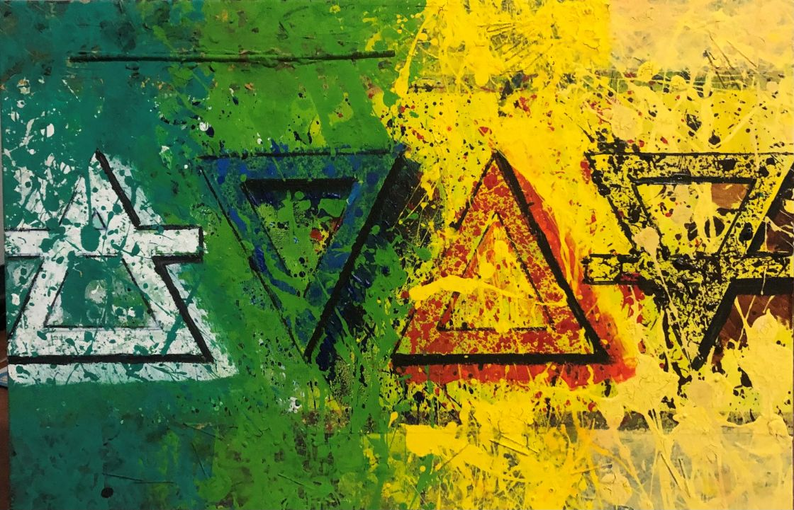

# La familia

- Es un cuadro más personal.
- En casa son 4, y ha querido representar a su familia con los 4 elementos: el aire pintado en blanco, el agua pintado en azúl, el fuego pintado en rojo y la tierra en marrón.
- Una cosa sin la otra no funciona, o siembra el caos, p.e. si le quitas el agua a estos elementos obtienes ceniza. Que no es la mejor manera de convivir.
- Es la dependencia de unos y de otros. Cuando se da el paso de formar una familia, necesitan estar unidos, vivir en harmonía, como viven los cuatros elementos, por supervivencia.
- Era un regalo para la familia.
