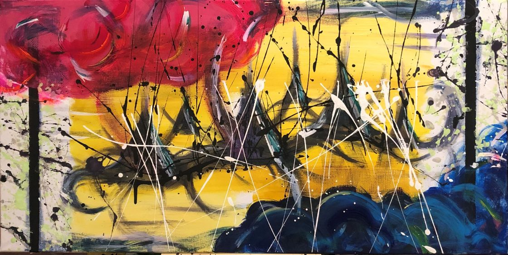

# Dualismo

- Con el objetivo de representar un cuadro a partir de los 3 colores básicos (cyan, amarillo y magenta), la mezcla de los tres colores da como resultado lo material, o lo que el ser humano puede controlar, el centro.
- Hay unos límites dibujados en el cuadro, que representarían hasta donde el ser humano puede controlar o puede explicar.
- Pero si nos fijamos en la nebulosa magenta o en la representación del mar en color azul, podemos observar como esos fenómenos son los que nos pueden impedir determinar lo que para nosotros es el infinito, y que a su vez, son los únicos elementos que el ser humano no puede controlar ni franquear —esos límites.
- Mediante el dripping se ha intentado representar el dualismo, ya que el dripping negro solo va hacia arriba, y el dripping blanco va hacia la parte inferior.
- Esas figuras materiales —los triángulos— no dejan ver el Sol en algunos momentos de la vida —el Sol está representado, con el reflejo abajo.
- El dualismo se podría representar también mediante las nubes y el agua, donde se pueden ver los reflejos del sol en ciertas partes de esos elementos.
- El agua es azul, porque siempre la vemos así, pero las nubes son rojas, porque no siempre tienen el mismo color. De ahí que haya verde y naranja en la nube rosa.
- Podrían representar el cielo —como mar— y el infierno, como nube, invertidos.
- Hay una asimetría en diagonal, pero con los elementos tradicionales del dualismo intercambiados: cielo abjo e infierno arriba, luz abajo y oscuridad arriba...
- En los márgenes hay dripping para no dejar los márgenes en blanco, pero puede representar lo cósmico. Pueden ser cosas sin sentido que franquean esos márgenes: el agua se puede llegar a controlar en una presa, porque está dentro de nuesrto ambiente; pero una estrella, a millones de años luz, es un punto sin explicación. Lo que entra y sale de los márgenes, de manera puntual, vendrían a explicar el espacio, lo cósmico...
