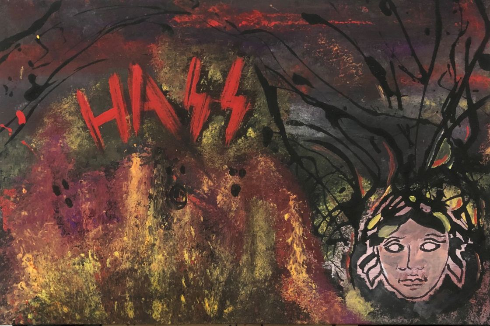

# Hass

- Hass significa Odio en Alemán.

- Figura el odio que siente sobre la sociedad y el sistema. Y sobre muchas de las personas / actitudes que le rodean.

- Representado por la cabeza de Medusa y una ciudad en llamas.

  - Medusa, que significa guardiana o protectora, era una bellísima sacerdotisa del templo de Atenea (diosa de la sabiduría). Tenía unos hermosos cabellos que la dotaban de una belleza sin igual. Muchos eran los pretendientes y enamorados de Medusa.

  - Poseidón, dios del mar, quedo prendido de la belleza de la sacerdotisa. Enamorado de ella, elaboro un plan para reunirse con su amada. Poseidón se transformó en ave para entrar en el templo de Atenea y juntarse con Medusa. La diosa Atenea se sintió muy ofendida, no le gusto que su templo fuese usado para otros fines distintos a los que tenía destinados. Desato su enfado contra Medusa y como castigo, trasformo sus hermosos cabellos en serpientes y otorgo un don fatal a los ojos de la sacerdotisa: el poder de transformar en piedra a todos cuantos mirarse.

  - Polidectes, el rey de Sérifos, decidió enviar a Perseo, hijo del Dios Zeus y la mortal Dánae, para que matara a Medusa. Para que Perseo logrará su objetivo, los dioses le otorgaron útiles regalos: Hermes, dios de las fronteras y los viajeros le dio unas sandalias aladas y una capa de invisibilidad. Hades, dios de los muertos, una espada, un casco y un escudo espejado. Atenea le ofreció su espejo. Con el escudo y el espejo, Perseo podría ver los objetos sin poder ser visto. Así podría ver a Medusa sin ser visto por ella y convertido en piedra.

  - Así fue como Perseo, llegó hasta la sacerdotisa sin que esta se percatase de su presencia, conducido por Atenea cortó la cabeza de Medusa. Esta cabeza se convirtió en un trofeo para Perseo, lo llevaba a todas partes y lo empleaba para convertir en piedra a todos sus enemigos.

  - Perseo logró vencer a todos sus enemigos y le entrego a Atenea la cabeza de Medusa.

- Por otra parte Hass está escrito con el simbolo de las Schutzstaffel:

  - "Cuando en 1933 se produjo el incendio al Parlamento Alemán (Reichstag), el Canciller Adolf Hitler, en calidad de Führer, redactó un decreto el 29 de Febrero mediante el que se otorgaba poderes policiales tanto a las SA como a las SS, a las que además se las equipó con armamento procedente del Ejército Republicano Alemán (Reichswehr). A partir de ese instante, las escuadras de las SS que se habían convertido en una nueva policía auxiliar dirigida por el Reichsführer Heinrich Himmler, iniciaron arrestos sistemáticos contra los opositores de derechas e izquierdas, apalearon a todos los que ofrecieron resistencia e incluso asesinaron de forma discreta a los elementos considerados más peligrosos, sin contar los ataques a la comunidad judía y boicots a sus comercios. De hecho y en cuanto las cárceles y prisiones estuvieron saturadas de personas, las SS abrieron el campo de concentración de Dachau a las afueras de Munich para albergar a los millares de prisioneros políticos, un recinto al que siguieron Sachsenshausen cerca de Berlín y Buchenwald próximo a Weimar, los cuales pasaron a estar gestionados por la Oficina de las Cabezas de la Muerte o “Totenkopfverbände”.

  - Mientras las SS y las SA desmantelaban la antigua República de Weimar, la brecha entre ambas se volvió más grande que nunca debido a sus insalvables diferencias. Las SA del general Ernst Röhm defendían la tesis de una “segunda revolución nacionalsocialista” mucho más radical que la primera en los económico y lo social; y las SS de Heinrich Himmler preferían mantener el estatus vigente ordenado por el Führer para llevar a cabo el proceso revolucionario de manera más pausada y con ello evitar una reacción de la oficialidad conservadora del Ejército Alemán que veían en el nacionalsocialismo una especie “comunismo disfrazado”. Precisamente durante aquellos tensos meses de rivalidad, los miembros de las SS calificaron a sus socios de las SA con el nombre de “filetes (fleishschnitten)” porque según ellos eran “pardos por fuera y rojos por dentro”. Esta evidente confrontación y también la amenaza que suponían sus 2 millones de paramilitares que superaban veinte veces el tamaño del Ejército Alemán, obligó a Hitler a tomar la decisión de purgar sus filas y ganarse su entera lealtad.

  - Inesperadamente entre el 28 y el 30 de Junio de 1934, las SS efectuaron una serie de redadas sorpresa contra los líderes de las SA y rivales susceptibles de traición dentro del NSDAP y la Cancillería en un episodio que sería conocido como la “Noche de los Cuchillos Largos”. La mayor parte de los arrestos o asesinatos que se llevaron a cabo de noche y de manera sorpresiva, acabaron con la purga de todos los cuadros de mando de las SA, incluyendo el general Ernst Röhm que fue matado a tiros en una celda o los capitanes Karl Enst y Edmund Heines que resultaron ejecutados. También las SS aprovecharon la ocasión para asesinar a dos militares disidentes como los generales Kurt Von Schleicher y Ferdinand Von Bredow, al antiguo líder nacionalsocialista Gregor Strasser, a Erich Klausener que dirigía el Partido Acción Católica y al gobernador bávaro Gustav Von Kahr a quién destrozaron la cabeza a porrazos. Una vez concluida la “Noche de los Cuchillos Largos” con más de 300 ejecuciones y obtenido el control total sobre las SA que pasaron a depender de Vikor Lutze, un hombre completamente leal al Führer, las SS se convirtieron en la organización más poderosa de Alemania.

  - Oficialmente el 20 de Julio de 1934, las SS fueron rebautizadas por Adolf Hitler como la Allgemeine-SS. Conformada en aquellos instantes por 200.000 hombres, las SS no solamente ostentaron la categoría de ser la nueva policía política del Tercer Reich, sino que además ejercerían el control de Europa durante la Segunda Guerra Mundial."

- Lo que se pretende transmitir con Hass escrito de tal manera, es el reflejo vivido en la história, del odio y la desconfianza entre nosotros mismos como sociedad, tal y como pasó entre las SA y las SS. Sembrando el temor, cometiendo crímenes de guerra con la finalidad de obtener el poder y el control de toda Alemania.

[Volver](https://victorrodrigueznavarro.github.io/)
